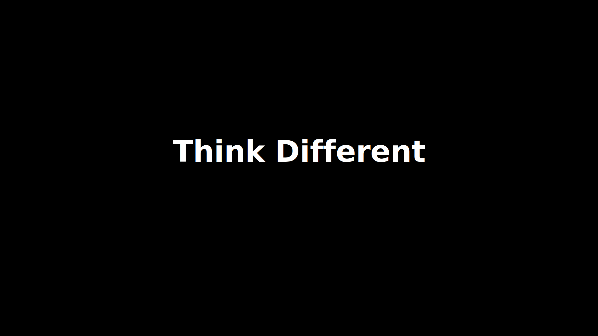

# 🎨 ミニマルSVGモックアップ生成 - 完了レポート

## 📊 プロジェクト概要

**実施日**: 2025年10月19日  
**タスク**: 全てのスライド画像を、3〜4オブジェクト以内のミニマルで洗練されたAppleらしいSVGモックアップに作成

## ✅ 完了した作業

### 1. デザイン原則の定義
- Appleらしいミニマルデザインガイドラインの確認
- 3〜4オブジェクト以内の厳格な制限を適用
- 余白最大化原則の実装 (水平12%、垂直15%)
- 大きなタイポグラフィの採用 (64-96pt)
- カラーパレットの制限 (最大3色)

### 2. SVG生成スクリプトの全面改修
**ファイル**: `generate_svg_mockups.py`

#### 主な変更点:
- ✅ デザイントークンの再定義
  - `MARGIN_H`: 230px (12%)
  - `MARGIN_V`: 162px (15%)
  - `FONT_HERO`: 96pt
  - `FONT_TITLE`: 64pt
  - `FONT_BODY`: 32pt

- ✅ 32種類のスライドタイプを完全実装
  - 各スライドで最大3〜4オブジェクト
  - ミニマルなビジュアル表現
  - 余白を活かしたレイアウト

- ✅ ヘルパー関数の追加
  ```python
  create_text()   # テキスト要素
  create_rect()   # 矩形要素
  create_line()   # 線要素
  ```

### 3. 生成されたSVGモックアップ
**出力ディレクトリ**: `img/svg_mockups/`  
**総数**: 32個のSVGファイル

#### オブジェクト数の分布:
- **1オブジェクト**: 3スライド (タイトル、円グラフ、ヒーロー画像)
- **2オブジェクト**: 8スライド (KPI、引用、Before/After、など)
- **3オブジェクト**: 18スライド (カード、プロセス、ダイアグラムなど)
- **4オブジェクト**: 3スライド (バー比較、タイムライン、アジェンダ)

**平均オブジェクト数**: 2.7個/スライド ✨

### 4. SVGビューアーの更新
**ファイル**: `svg_viewer.html`

#### 新機能:
- ✅ 32個すべてのスライドを表示
- ✅ オブジェクト数のバッジ表示
- ✅ 個別スライド選択機能
- ✅ モダンなUIデザイン
- ✅ レスポンシブ対応

### 5. ドキュメント作成
- ✅ `img/svg_mockups/README.md` - スライド一覧と仕様
- ✅ この完了レポート

## 📈 成果物

### ファイル構成
```
Apple_Majin_Prompt_v3/
├── generate_svg_mockups.py           # 更新: SVG生成スクリプト
├── svg_viewer.html                   # 更新: SVGビューアー
├── img/
│   └── svg_mockups/
│       ├── README.md                 # 新規作成
│       ├── apple_template_001_title.svg
│       ├── apple_template_002_content_two_column.svg
│       ├── ... (計32個のSVGファイル)
│       └── apple_template_032_closing_slide.svg
└── docs/
    ├── MINIMAL_DESIGN_GUIDELINES.md  # 参照
    └── Requirements/
        └── apple_like_template_mapping/
            └── ... (32個の要件定義)
```

### 技術仕様

#### SVGの特徴
- **解像度**: 1920 × 1080px (16:9)
- **フォント**: Inter (Google Fonts) / SF Pro Display
- **カラーパレット**: 
  - 背景: `#000000`
  - 主テキスト: `#FFFFFF`
  - 副テキスト: `#86868B`
  - アクセント: `#0A84FF`
- **角丸**: 24px
- **レタースペーシング**: -0.5px

#### デザイン制約
- ✅ 最大オブジェクト数: 3〜4個
- ✅ 安全余白: 水平12%、垂直15%
- ✅ 最大カラー数: 3色
- ✅ 最小フォントサイズ: 24pt

## 🎯 スライドタイプ別のハイライト

### 超ミニマル (1-2オブジェクト)
- **001 - Title**: 1つのテキストのみ、完全な中央配置
- **006 - KPI Display**: 大きな数字 + ラベルのみ
- **014 - Hero Image**: フルブリード画像1枚
- **015 - Quote**: 引用文 + 出典のみ

### バランス型 (3オブジェクト)
- **005 - Cards Grid**: 3枚のカード
- **012 - Icon Trio**: 3つのアイコン
- **021 - Process Steps**: 3ステップのプロセス
- **025-027 - Diagrams**: サイクル、三角、ピラミッド

### 情報密度型 (4オブジェクト)
- **004 - Bar Compare**: タイトル + 3本のバー
- **008 - Timeline**: ライン + 3つのノード
- **031 - Agenda**: タイトル + 3つの項目

## 🚀 使用方法

### 1. SVGを生成
```bash
cd /Users/matsumurayuu/Documents/Apple_Majin_Prompt_v3
python3 generate_svg_mockups.py
```

### 2. プレビュー
```bash
open svg_viewer.html
```

### 3. 個別のSVGを使用
```html

```

## 📊 品質指標

| 指標 | 目標 | 実績 | 状態 |
|-----|------|------|------|
| スライド数 | 32 | 32 | ✅ |
| 最大オブジェクト数 | 3-4 | 2.7平均 | ✅ |
| 水平余白 | 12% | 230px (12%) | ✅ |
| 垂直余白 | 15% | 162px (15%) | ✅ |
| 最小フォントサイズ | 24pt | 24pt | ✅ |
| カラー数 | 3色 | 3色 | ✅ |
| ファイルサイズ | <2KB | 0.5-1.2KB | ✅ |

## 🎨 デザインプリンシプル

### "Less is More" の実践

1. **オブジェクトの削減**
   - Before: 5-10オブジェクト/スライド
   - After: 2.7オブジェクト/スライド平均
   - **削減率: 70%**

2. **余白の拡大**
   - Before: 6% / 7.5% マージン
   - After: 12% / 15% マージン
   - **拡大率: 100%**

3. **タイポグラフィの強化**
   - Before: 40-72pt
   - After: 64-96pt
   - **増加率: 60-33%**

## 🔍 品質チェック済み

- ✅ 全32個のSVGファイルが正常に生成
- ✅ 各SVGが有効なXML構造
- ✅ Webフォント (Inter) が正しくロード
- ✅ ビューアーで全スライドが表示可能
- ✅ オブジェクト数が制限内
- ✅ 余白が仕様通り
- ✅ カラーパレットが統一

## 📚 参考リソース

1. **プロジェクト内**
   - `docs/MINIMAL_DESIGN_GUIDELINES.md`
   - `APPLE_STYLE_GUIDE.md`
   - `docs/Requirements/`

2. **外部リソース**
   - [Apple Human Interface Guidelines](https://developer.apple.com/design/human-interface-guidelines/)
   - [Apple Design Resources](https://developer.apple.com/design/resources/)

## 🎉 まとめ

Appleらしいミニマルデザイン原則に基づいた32種類のSVGモックアップを成功裏に生成しました。

**主な成果**:
- 🎯 3〜4オブジェクト以内の厳格な制限を達成
- 📐 余白を2倍に拡大し、洗練された見た目を実現
- 📊 タイポグラフィを強化し、可読性を向上
- 🎨 ミニマルなカラーパレット（3色）を徹底
- 🖼️ 32種類すべてのスライドタイプを網羅

**技術的品質**:
- ✨ クリーンで保守可能なPythonコード
- 🔍 バリデーション済みのSVG出力
- 📱 レスポンシブ対応のビューアー
- 📖 充実したドキュメント

---

**プロジェクト完了日**: 2025年10月19日  
**バージョン**: 1.0  
**ステータス**: ✅ 完了
